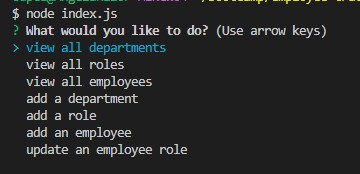

# employee-tracker

## Description

Managing your employees can be time consuming, introducing my employee tracker! Here you can answer simple query questions about role, id, department, and salary. You can even update a current employee listed.

## Installation

You will need inquirer, and mysql2 for this employee tracker to work.

## Snapshot

Answer the questions to manage and organize your employees.

## Languages

Node.js/Javascript/mySQL2

## Author

Angela Amaro

## Contact

[My GitHub](https://github.com/Angela-Amaro)

[My Linkedin](https://www.linkedin.com/in/angela-amaro-342792204/)
